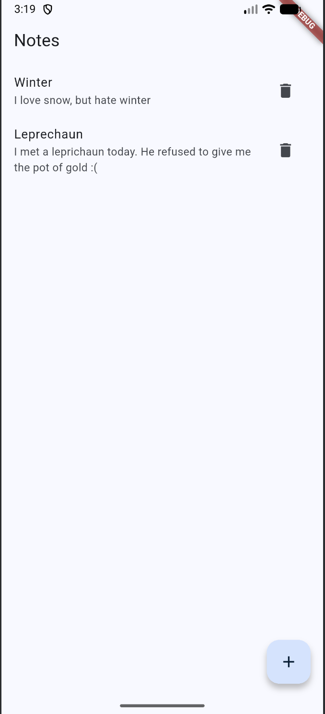
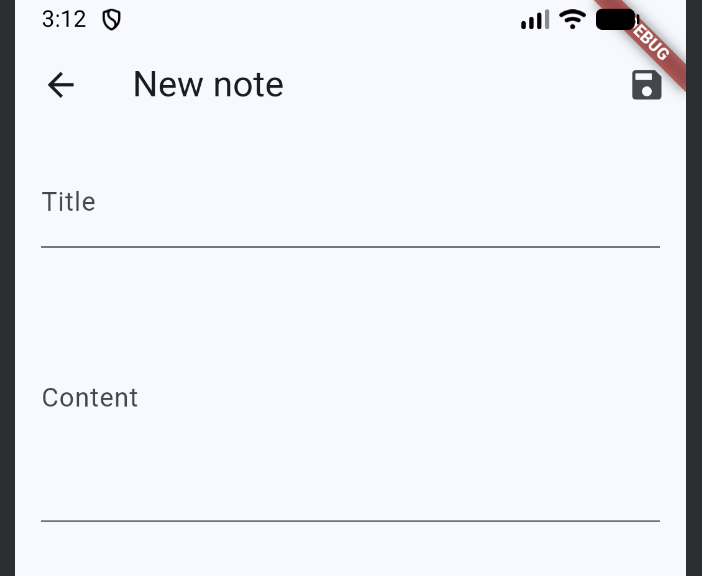

# Notes App (Flutter)

Notes App is a simple application for creating and editing notes.  
This project was created to practice the **MVVM architecture** in Flutter.


## Architecture

The project follows the **MVVM (Model–View–ViewModel)** pattern:

- **Model** — data structure of a note
- **View** — UI screens
- **ViewModel** — business logic and state management


## Features

- View notes list
- Add a new note
- Edit an existing note
- Delete a note
- Navigation between screens


## Screenshots





## Run the project

```bash
flutter pub get
flutter run